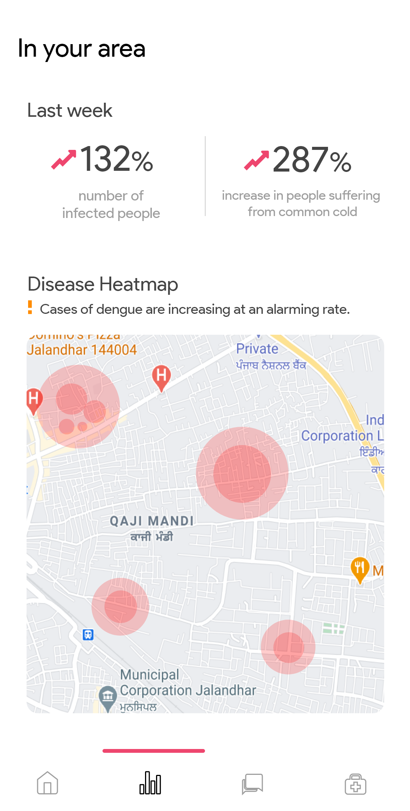

## CODE-RED 🔴

### Project Info

The contents in this project follow the following structure, where all views are containerised into screens.

```
├───models
|
├───screens
│   ├───consult
│   ├───forums
│   ├───home
│   └───stats
|
├───services
│
├───shared_widgets
│
└───utils
```

Each individual screen in the above, follow this structure

```
screen
  ├──local_widgets
  └──index.dart
```

#### Constants

This project uses 'Product Sans' as it's primary font, with weights of 400 and 600. All the fonts have been pre-imported.

Moreover, here are a few constants which are used throughout the project, and have been added within a **CodeRedColors** class, use them accordingly.

```
base            : FAFAFAF
primary         : EE466E
inactive        : 9E9E9E
primary2        : 6246EE
inputFields     : F3F3F3
medicineCard    : FDA8F3
```

#### Designs

All the design/mockups for the app have been added in the `designs` directory. You can use those for reference.



## Learn More

For help getting started with Flutter, view our
[online documentation](https://flutter.dev/docs), which offers tutorials,
samples, guidance on mobile development, and a full API reference.

[](https://github.com/ishandeveloper)
